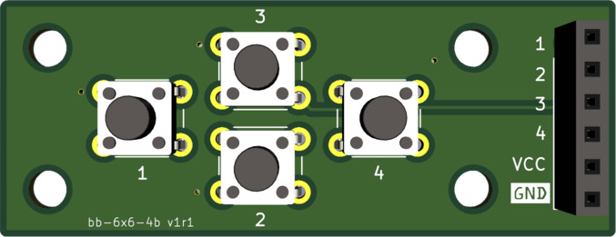

# button-board-6x6mm-4buttons

External button board for buttons for Arduino or Raspberry Pi.

- Dimensions: 52 x 36 mm
- Mounting holes: M3 holes (3.2 mm), distance 36 and 20 mm
- Buttons: 6x6 mm tactile push buttons

This board can be used for Button pins, which are pulled high or pulled low. If the button pin is pulled low, solder a bridge to VCC for that button.

__Instructions__

- Solder a bridge on the back side of the board for every button. For a pin which is pulled low by default, solder the bridge to GND.

__More PCBs__

- [Button Board with 3 Buttons](https://github.com/zytzeiche/button-board-6x6mm-3buttons)
